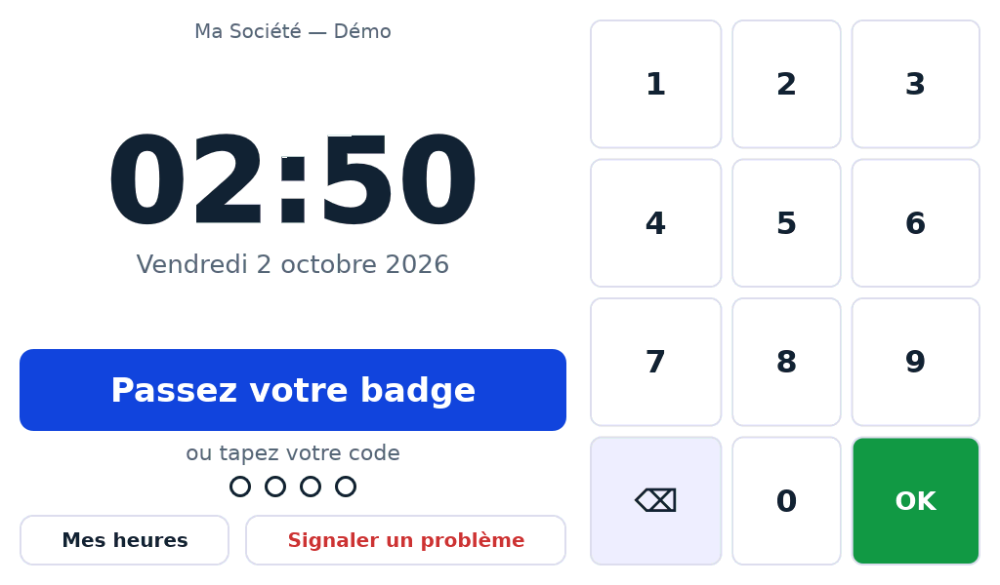
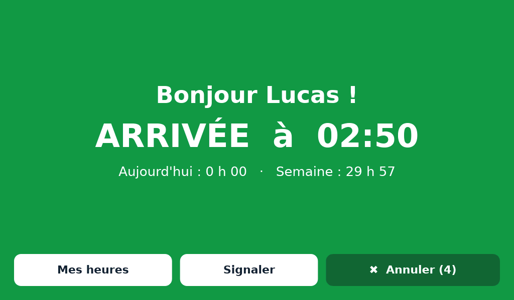
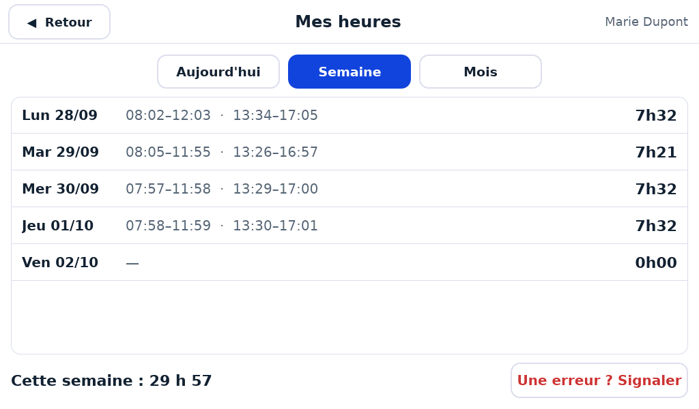
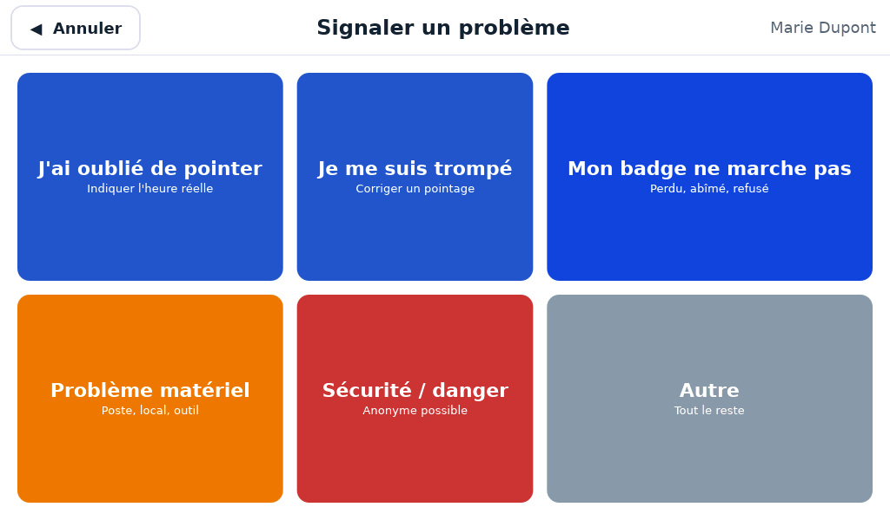
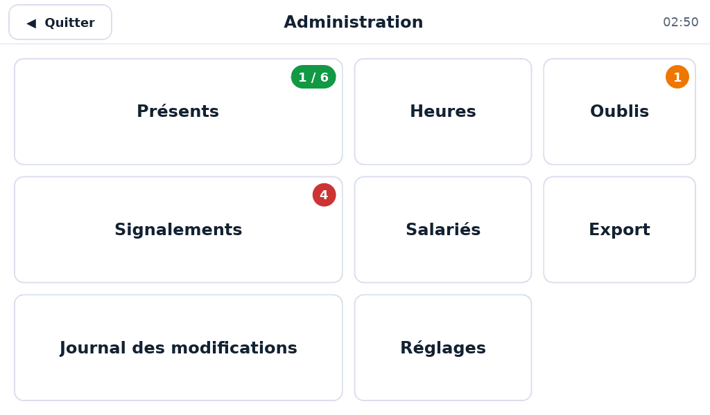
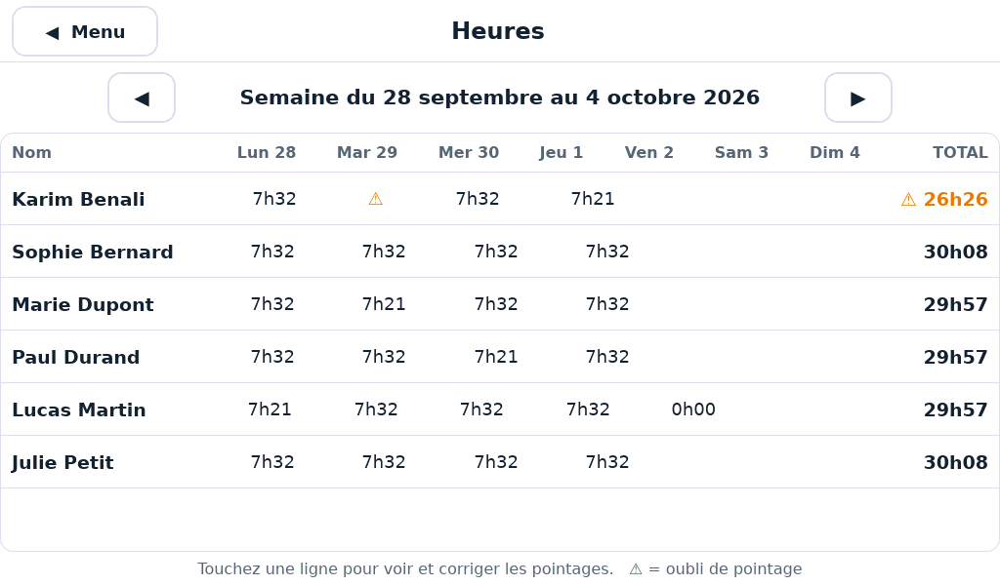
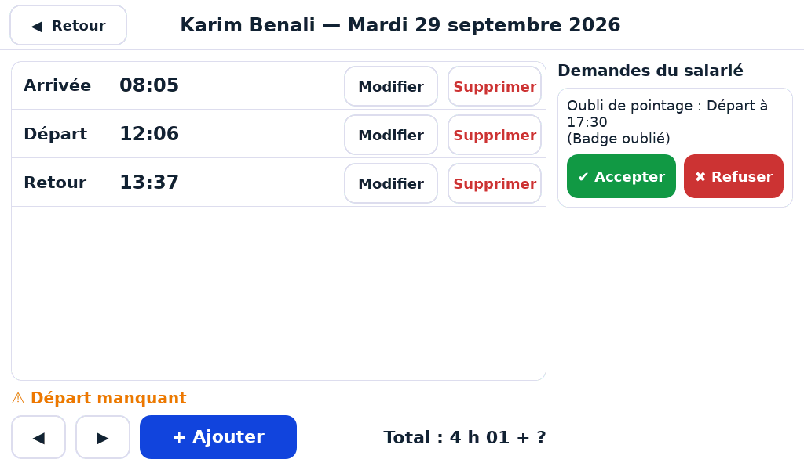

# Badgeuse — pointage des horaires sur tablette 7"

Application de pointage en **Rust + [Slint](https://slint.dev)**, pensée pour un écran tactile
7 pouces (1024×600 ou 800×480) placé à l'entrée. Données stockées localement en **SQLite** :
tout fonctionne sans internet.



## Fonctionnement

- **Pointer** : passer sa carte (ou taper son code à 4 chiffres). L'application déduit
  l'action : 1er pointage du jour = *Arrivée*, puis *Départ*, *Retour*, *Départ*…
  Un écran de couleur confirme pendant 4 s, avec un bouton **Annuler**.
- **Anti double-badge** : un 2e passage dans les 2 minutes est refusé (« Déjà pointé »).
- **Mes heures** : chaque salarié consulte son jour, sa semaine, son mois.
- **Signaler un problème** : oubli de pointage (correction proposée au responsable),
  erreur, badge, matériel, sécurité (anonyme possible), autre.
- **Administration** (appui long de 3 s sur l'horloge, puis code à 6 chiffres) :
  présents, heures par semaine, correction des pointages (motif obligatoire),
  oublis, signalements, salariés et badges, export CSV, journal des modifications, réglages.

Code administrateur par défaut : **000000** — à changer dès l'installation (Réglages).

| | | |
|---|---|---|
|  |  |  |
|  |  |  |

Toutes les captures sont dans [`docs/captures`](docs/captures).

## Calcul des heures

Les pointages d'une journée sont pris par paires (entrée → sortie) et additionnés.
Une journée passée avec un nombre impair de pointages est signalée comme **oubli** : la
période ouverte n'est pas comptée tant qu'un administrateur ne l'a pas corrigée.
Limite de la V1 : une période qui passe minuit (travail de nuit) n'est pas gérée.

## Lecteur de badge (MIFARE DESFire EV3)

Utiliser un lecteur USB **13,56 MHz (ISO 14443-A) en émulation clavier** : il « tape »
le numéro de la carte suivi d'Entrée, l'application le capte sans pilote.

- Les cartes DESFire doivent être en **UID fixe**. Si l'option *Random ID* est activée,
  le numéro change à chaque lecture et la carte ne sera pas reconnue.
- Si le lecteur est réglé en QWERTY sur un système AZERTY, les chiffres arrivent en
  `&é"'(…` : l'application les reconvertit automatiquement.
- Pour associer une carte : Admin → Salariés → fiche → *Associer un badge* → passer la carte.

## Installation (Raspberry Pi OS / Debian / Ubuntu)

```sh
sudo apt install build-essential libfontconfig1-dev libxkbcommon-x11-0
curl https://sh.rustup.rs -sSf | sh        # Rust
cd badgeuse
cargo build --release
./target/release/badgeuse --plein-ecran
```

Options :

| Option | Effet |
|---|---|
| `--plein-ecran` | mode borne, plein écran |
| `--donnees DOSSIER` | emplacement de la base (défaut `~/.local/share/badgeuse`, ou variable `BADGEUSE_DONNEES`) |
| `--demo` | remplit une base vide avec 6 salariés fictifs (codes 1111 à 6666) |
| `--captures DOSSIER` | développement : enregistre une image de chaque écran |

Essai rapide sur un PC : `cargo run -- --demo`, puis taper `1111` sur le pavé, ou
saisir `04A23F1B` + Entrée au clavier pour simuler la carte de Marie.

### Démarrage automatique en mode borne (Raspberry Pi OS)

Créer `~/.config/autostart/badgeuse.desktop` :

```ini
[Desktop Entry]
Type=Application
Name=Badgeuse
Exec=/home/pi/badgeuse/target/release/badgeuse --plein-ecran
```

Penser aussi à : désactiver la mise en veille de l'écran, masquer le curseur
(`unclutter`), et régler l'heure automatiquement (NTP) — l'heure du système fait foi.

## Données et sauvegarde

Tout est dans `badgeuse.db` (SQLite). Pour sauvegarder, copier ce fichier (par exemple
chaque nuit vers une clé USB ou un dossier réseau). L'export CSV (séparateur `;`,
heures décimales avec virgule) s'ouvre directement dans Excel ; il est écrit sur la clé
USB si elle est branchée, sinon dans `exports/` à côté de la base.

Le journal des modifications est protégé en écriture dans la base : aucune ligne ne peut
être modifiée ni supprimée.

## Cadre légal (France)

- Pas de biométrie ni de photo au pointage (interdit par la CNIL pour la gestion des horaires).
- Informer les salariés et consulter le CSE avant la mise en service.
- Définir une durée de conservation des données de pointage.

## Organisation du code

| Fichier | Rôle |
|---|---|
| `src/pointage.rs` | règles métier pures : nature du pointage, calcul des heures, anti double-badge (testé) |
| `src/db.rs` | base SQLite (testée) |
| `src/app.rs` | pilotage des écrans : chaque appui appelle `Etat.action(nom, nombre, texte)` |
| `src/export.rs` | export CSV et détection de la clé USB |
| `ui/etat.slint` | état partagé interface ↔ Rust |
| `ui/composants.slint` | boutons, pavé numérique, clavier AZERTY, sélecteur d'heure |
| `ui/ecrans_salarie.slint`, `ui/ecrans_admin.slint` | les écrans |

Tests : `cargo test`.

## Prévu pour la suite

- **V2** : horaires prévus et retards, solde d'heures sup, alertes de pause et 10 h/jour,
  sauvegarde automatique, messages du responsable, sons, veille la nuit.
- **V3** : tableau de bord web sur le PC du responsable, notifications, demandes
  d'absence, plusieurs badgeuses synchronisées.
